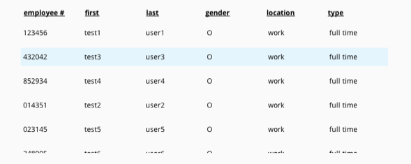

employee database: user manual

The purpose of the employee database is for a human resources manager to
manage employee information in a company. The functions allowed in this
program are: adding, editing, and removing employees, searching for
employees by employee number, and displaying employee information. All
information is also saved to a save file named employeeDatabase.csv ­--
more on this later.

There are two types of employees -- part-time and full-time. There will
be different methods of calculating income for these different
employees.

1\. startup

Upon opening a new instance of the employee database, the following will
be seen:

{width="3.937007874015748in"
height="1.4549267279090115in"}

*The first time opening the employee database.*

The number of employees will be indicated at the top (currently 0),
along with a button to add employees. Clicking on this button will open
up a new panel to the side to enter information for the new employee.

Underneath this button is an input to search for employees by employee
number; further below is a table displaying the current employees in the
system (currently empty).

2\. adding employees

Clicking on the "add employee" button will bring up a new panel: the
employee information editor. It looks something like this:

{width="3.9368055555555554in"
height="2.8519028871391074in"}

*The initial view of the employee information editor.*

A few input fields can be seen: first name (first), last name (last),
employee type (type), employee gender (gender), employee number (emp.
\#), deductions rate (ded. rate), and work location (location). These
fields will be required for both types of employees; after choosing a
type, additional fields will appear below. For full-time employees, an
input will appear for the yearly salary (salary). Part-time employees
will have three new fields: hourly wage (wage), hours worked in a week
(hours), and weeks worked in a year (weeks).

The confirm button will add the new employee to the system if all inputs
are correct. These changes will be automatically updated in the main
dashboard. After successfully adding the employee, the inputs will be
reset. The new information will automatically be saved in the save file.

The reset button will reset all the information in the editor.

2.1 navigation in the editor panel

Although clicking on different fields to select them will work, keyboard
shortcuts are often much faster for data entry. The cursor will be
focused on the first name field upon entry; this is where the *focus*
is.

This *focus* can be moved by pressing the "tab" key on the keyboard to
move forward one field, and pressing "shift + tab" will move the focus
to the previous field. In addition to this, pressing the "enter" key
will move the focus to the next field as well. In this manner, the use
can simply type in the desired information in the current field and
press "enter" to continue. The enter key will also select the
highlighted button on selection fields (before moving on to the next
field), such as the employee type and gender.

{width="3.937007874015748in"
height="0.36131233595800527in"}

*"part-time" is in focus (highlighted); pressing enter will select the
part-time employee. Pressing enter will move the focus to "M" of the
gender field.*

Using keyboard shortcuts and moving the focus will allow the user to
progress until the focus reaches the "confirm" button. Pressing enter at
this point will add the new employee to the system.

{width="3.937007874015748in"
height="2.8871391076115485in"}

*A completed full-time employee. The focus is on the confirm button.*

Experienced users will notice that pressing "tab" will cycle the focus
back to the first name field; ignoring the reset button. However,
pressing "shift + tab" on the first name field will bring the focus to
the last element, the reset button. This is intentional to prevent
accidentally erasing information.

3\. errors

There may be error notifications when adding a new employee. Caution
signs will appear beside erroneous inputs and an error message will
appear at the bottom explaining one of the errors. As the inputs are
fixed, the error messages will change to reflect the updates.

The employee will not be added if there are errors in the inputs.

{width="3.937007874015748in"
height="2.873688757655293in"}

*Errors in the inputs. The deductions error is currently being
explained.*

3.1 requirements for first name

The first name of the employee must be at least 2 characters long.

3.2 requirements for last name

The last name of the employee must be at least 2 characters long.

3.3 requirements for employee type

The employee type must be selected, either full-time or part-time.

3.4 requirements for employee gender

The employee's gender must be selected, either male (M), female (F), or
other (O).

3.5 requirements for employee number

An employee number must be provided as a 6-digit integer; it must also
be unique. A separate error message will appear if the employee number
exists already.

3.6 requirements for deductions rate

The deductions rate must be a decimal between 0 and 1 (inclusive).

3.7 requirements for work location

The work location must be entered.

3.8 requirements for yearly salary (full-time employee)

The yearly salary must be a non-negative number.

3.9 requirements for hourly wage (part-time employee)

The hourly wage must be a non-negative number.

3.10 requirements for hours per week (part-time employee)

The hours per week worked by the employee must be between 0 and 168
inclusive.

3.11 requirements for weeks per year (part-time employee)

The weeks per year worked by the employee must be between 0 and 52
inclusive.

4\. viewing employees in the table

With employees in the database, the main table will now display one
employee per row:

{width="3.937007874015748in"
height="2.5481189851268593in"}

*Test users are shown in the table.*

The number at the top of the display shows the total number of
employees; scroll down on the table to view more.

To show more detailed information about each employee, as well as edit
current information and delete entries, click on the row of the desired
employee.

{width="3.9362587489063867in"
height="1.5707130358705161in"}

*Hovering over a row will highlight the entire row. Click to open up the
employee information panel.*

5\. employee information panel

After clicking on an employee in the table, an employee information
panel will appear. This will display all the attributes of that specific
employee; the net income will also be calculated.

For full-time employees, the calculation is:

$net\ income = yearly\ salary\  \times \ (1 - deductions\ rate)$

For part-time employees, the calculation is:

$$net\ income = hourly\ wage\  \times \ hours\ per\ week\  \times \ weeks\ per\ year\  \times \ (1 - deductions\ rate)$$

Pressing the delete button will delete the employee and remove it from
the save file.

Pressing the edit button will bring up an editing panel similar to the
one seen when adding a new employee. However, the two buttons at the
bottom of the panel are different -- they are now cancel and save.

Cancelling the edits will return the user to the employee information
panel without saving any edits; pressing save will save the changes and
return to the information panel (if there are no errors present).

{width="3.937007874015748in"
height="2.6175218722659666in"}

*The employee information panel; all information for a\
specific employee can be seen here.*

{width="3.937007874015748in"
height="2.572515310586177in"}

*The edit view for an existing employee. Existing information
prepopulates the input boxes; any edits are not saved until the save
button is pressed.*

Any changes to the employee database will automatically be saved in the
save file, whether it be a deletion or edit.

6\. the save file

A key feature of the employee database is the ability to save
information in a separate file for loading existing employees. All
employee data is stored in a save file named employeeDatabase.csv, which
is a comma-separated file (csv) that can be edited in any text editor or
spreadsheet program.

When loading up a save file, it must be named "employeeDatabase.csv" for
the program to recognize the file. Within the file, there is a special
format for storing the employee information -- if there are any
discrepancies in formatting, the program will return a warning message
and the database will be empty.

{width="3.937007874015748in"
height="2.0103871391076114in"}

*A warning message for a faulty save file. Note that the database is
empty, regardless of the contents of the faulty save file.*

Attempting to add new employees will overwrite the faulty save file.

The warning message also shows which line in the save file is causing
the error, allowing a manual fix for incorrectly formatted save files.

6.1 save file formatting

{width="6.5in" height="1.5215277777777778in"}

*Layout examples for the save file employeeDatabase.csv*

Each employee is represented by a row in the save file; in a text
editor, all fields will be separated by a comma. In a spreadsheet
program, the commas will be gone and each field will be in its own cell.
Editing information in the save file directly is perfectly fine, as long
as no errors are made when editing data.

7\. filtering by employee number

When viewing employees in the main dashboard, it is a common requirement
to search for an employee by their employee number. By entering numbers
in the search field, employees are automatically filtered out as the
user enters numbers. The employees displayed can be clicked on and
edited as usual.

To return to the list of all the employees, just clear the search field.

{width="3.937007874015748in"
height="2.537182852143482in"}

*Filtering a database of 8 employees down to 2 with a filter key of
"12".*
